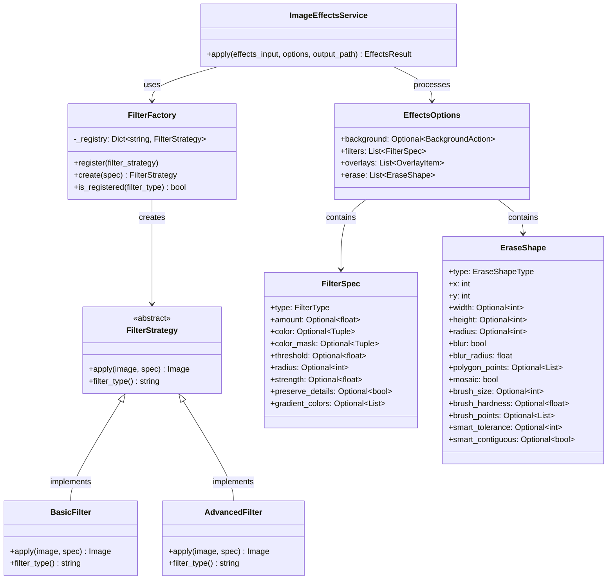

# Image Filters & Effects: System Design

This document outlines the design principles and architecture of the Image Filters & Effects service.

## Architecture Overview

The Image Filters & Effects service is built using modern design patterns to ensure maintainability, extensibility, and separation of concerns. The system allows for easy addition of new filters and effects without modifying existing code.

## Class Diagram

## Design Patterns Used

### Strategy Pattern
The Strategy pattern defines a family of algorithms, encapsulating each one, and making them interchangeable. This allows the algorithm to vary independently from clients that use it.

In our implementation:
- `FilterStrategy` is the abstract class that defines the interface for all filter strategies
- Concrete strategies like `GrayscaleFilter`, `CartoonFilter`, etc. implement the `apply` method
- Client code can switch between strategies without being aware of the concrete implementation

### Factory Pattern
The Factory pattern provides an interface for creating objects without specifying their concrete classes, allowing subclasses to alter the type of objects that will be created.

In our implementation:
- `FilterFactory` provides a centralized way to create filter strategies
- Filter strategies register themselves with the factory
- Client code requests filter objects through the factory without knowing concrete implementations

## Extensibility

To add a new filter:
1. Add the new filter type to the `FilterType` enum in `effects_models.py`
2. Create a new filter class that extends `FilterStrategy`
3. Implement the `apply` and `filter_type` methods
4. Register the new filter class with the `FilterFactory`

No changes to the main service logic or client code are required.

## Eraser System

The eraser system follows similar principles with a utilities-based approach:
- Multiple eraser shape types (rectangle, circle, polygon, brush, smart)
- Configurable parameters for each eraser type
- Dedicated utility functions for mask creation and application

## Future Enhancements

Potential future enhancements could include:
- Chain of Responsibility pattern for filter pipelines
- Observer pattern for progress tracking during image processing
- Command pattern for undo/redo functionality
- Decorator pattern for dynamic filter composition

